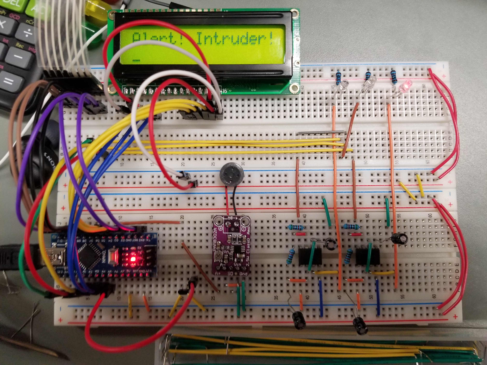

# Home Security System
Home security system for ATMega168p in C. Project by Cameron Archibald and team for ENGI2203 - Electrical Engineering Design I in Winter 2023. 

First learning experience with embedded C. Integrated with PIR, hall-effect sensor, matrix keypad, LCD display, and 555 timer to blink lights.

